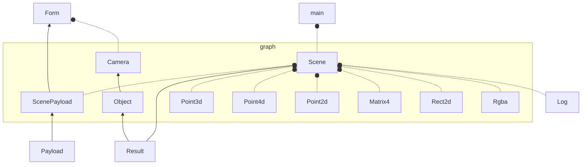
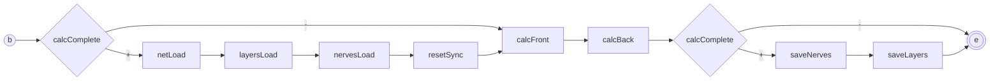

# Intro

1. To create truly universal consciousness:
    1. it should not be linked to human consciousness and habits, perhaps they are limited by evolution;
    0. it should not be focused on narrow tasks, they are a means, not an end;
    0. it should not be centralized;
    0. it should be free for development and exists.

Perhaps it will be *Shoggoth*.


# Shoggoth components

1. Processor - main calculation kernel proces;
0. Teacher - process for teaching the network;
0. Evolition - process for network evolition;
0. Ui - user interface.


# Requiremetns

1. Ubuntu 20.04 and more;
0. clang++ 17;
0. imagemagic libraries.


# Run

1. You need to install the following components:

```
sudo apt install -y 
    clang \
    libglfw3 libglfw3-dev libglu1-mesa-dev \
    libglew-dev \
    graphicsmagick-libmagick-dev-compat \
    upx
```

2. You need to clone following projects:
```
git clone git@github.com:johnthesmith/lib-core.git ./lib/core
git clone git@github.com:johnthesmith/lib-graph.git ./lib/graph
git clone git@github.com:johnthesmith/lib-sock.git ./lib/sock
git clone git@github.com:johnthesmith/lib-json.git ./lib/json
git clone git@github.com:johnthesmith/shab.git ./app/shab
git clone git@github.com:johnthesmith/shoggoth.git ./app/shoggoth
```

3. After that you need to run:
```
./make
```


## Components

1. The kernel of Shoggoth was written in c++ and requires the following projects:
    1. [lib/core](https://github.com/johnthesmith/lib-core) -  baisic c++ libraries;
    0. [lib/json](https://github.com/johnthesmith/lib-json) - object for key and values;
    0. [lib/graph](https://github.com/johnthesmith/lib-graph) - graphic library;
    0. [lib/sock](https://github.com/johnthesmith/lib-sock) - libraries for tcp sockets;
    0. [shoggoth](https://github.com/johnthesmith/shoggoth) - Shoggoth ptoject;
    0. [shab](#shab) - small bash maker for Shoggoth.


```mermaid
flowchart LR
    proj --> app
    proj --> lib
    app --> shab
    app --> shggoth
    lib --> graph
    lib --> json
    lib --> sock
    lib --> core
```


### Lib

1. Lib is contain the tiniy libraries for application with users controllers.


## Graph

1. User interface based on on [glfw](https://www.glfw.org/).
0. Supports:
    1. mouse events
    0. keyboards events
    0. math library for vectors operations
    0. matrix transformation


### OpenGL objects scheme



3. Solid line - extends class
0. Dotted line - uses class


### Shoggoth

1. Shoggoth - is a simple neural network (neuronet). Contains following components:
    1. [Neuron](#neuron) - element of neuronet with value and error.
    0. [Neuron Extention](#neuron-extention) - structure contains the optionl specific information about neuron like id, name etc.
    0. [Bind](#bind) - link between two neurns.
    0. [Layer](#layer) - the layer contains neurons.
    0. [Nerve](#nerve) - connection between layers, contains many of binds.
    0. [Net](#net) - it is a general oblect of neuronet with list of neurons.
0. Shoggoth library located at [src/shoggoth](src/shoggoth).


## Math definition

1. Each neuron have the:
    1. v - value [ 0; +1 ] 
    0. e - error [ -1; +1 ]
0. Neurons may have the bind between them.
0. Each bind have the:
    1. w - weight of bind [ -1; +1 ].
    0. type of bind
    0. p - parent neuron
    0. c - child neuron
0. Shogoth have the next linear sigmoid r form argument a:
    1. sig[0;1] = a < 0.0 ? a = 0.0 : ( a > 1.0 ? 1.0 : a )
    2. sig[-1;+1] = a < -1.0 ? a = -1.0 : ( a > 1.0 ? 1.0 : a )


### Neuron value calculated

1. Value of each neuron c calculated like sigmoid from sum of production of parents value on bind weight.
    c.v = sig[0;1]( sum( w * p.v ) )


### Neuron

1. The element of neuronet with Value and Error. Element can has the Extention for optional information.
0. Neuron is defined in [Neuron](./lib/neuron/neuron.h). 
0. Neuron uses the sigmoid function to calculate Value and derivative sigmoid function to calculate Error in learning mode.


### Neuron extention

1. It is a optional structure for neurons. 
0. Each neuron may or not may has one Extantion.
0. The extention will be created for the neuron on demand, when user setts the advinced parameter.
0. No extentions needed for huge [layers](#layer).


### Nerve

1. Nerve analogue of the biological nerve.
0. The nerve connects the two layers and creates multiple connections between the neurons of the parent and child layers.
0. Each nerve has:
    1. the parent layer
    0. the children layer
    0. type of nerve
    0. connection type


### Layer

1. The layer it is the [object](#object) and contains neurons.
0. The layer is the analog of biological organ or cortex section.
0. Each layer has a unique auto-generated identifier for identification and a human readable name.


### Net


## Shoggoth scheme





## Authors

- [@igptx](https://www.github.com/igptx)
- [@johnthesmith](https://www.github.com/johnthesmith)
