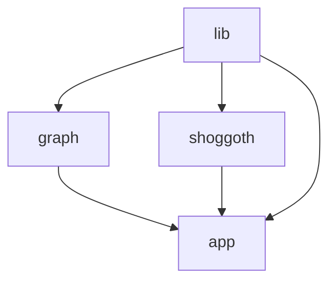
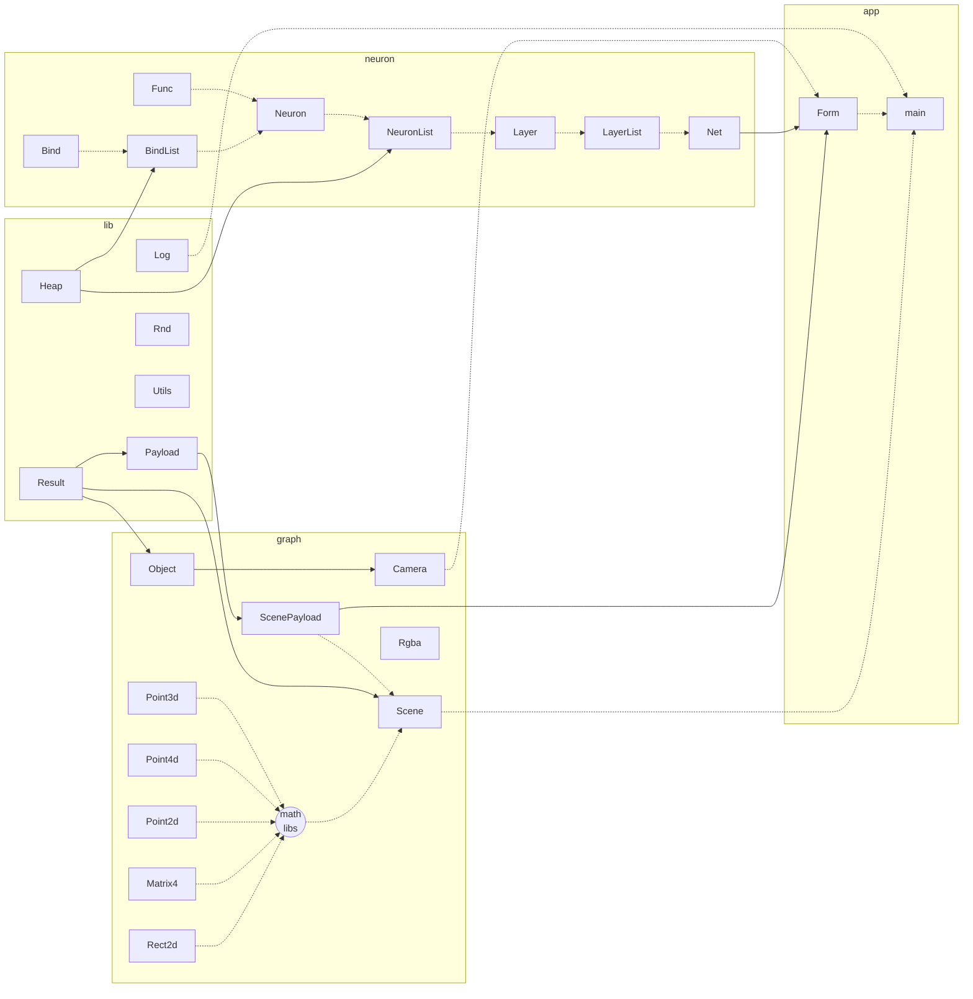
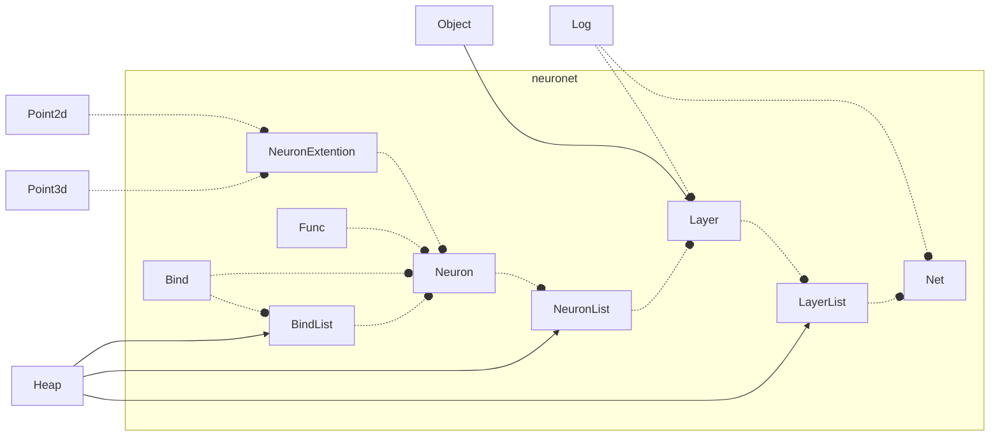

# Shoggoth

This is [Shoggoth](https://github.com/johnthesmith/shab) neuronet with visual control.


# Run

``Shab`` is building at Ubuntu 18.04 and more.

You need to install the following components:

```
sudo apt install libglfw3 libglfw3-dev libglu1-mesa-dev
sudo apt install upx
```

After that you need to run:
```
./make
```


# Components

The kernel was written in c++ and contains next components:

1. [app](#app) - application
0. [lib](#lib) - baisic c++ libraries
0. [graph](#opengl) - graphics librayes
0. [shoggoth](#neuronet) - neurlal net Shoggoth libraryes
0. [shab](#shab) - small bash maker for Shoggoth


```mermaid
flowchart
    graphics[graph]    

    lib --> graphics
    graphics --> app
    shoggoth --> app
    lib --> shoggoth
    lib --> app
```


## Lib

1. Lib is contain the tiniy libraries for application with users controllers.


## Graph

1. User interface based on on [glfw](https://www.glfw.org/).
0. Supports:
    1. mouse events
    0. keyboards events
    0. math library for vectors operations
    0. matrix transformation


### OpenGL objects scheme


```mermaid
flowchart LR

ScenePayload
Camera

math((math<br>libs))

subgraph app
    main
    Form
end

subgraph lib
    Heap
    Result
    Payload
    Log
    Rnd
    Utils
end

subgraph graph
    Object
    Camera
    ScenePayload
    Scene
    math
    Point3d
    Point4d
    Point2d
    Matrix4
    Rect2d
    Rgba
    
end

subgraph neuron
    Bind
    BindList
    Layer
    LayerList
    Net
    Neuron
    NeuronList
    Func
end


Payload --> ScenePayload
Camera -.-> Form


ScenePayload-.-> Scene

Object --> Camera
Result --> Payload
Result --> Scene
Result --> Object


Log -.-> main

Form -.-> main
Scene -.-> main

Point3d -.-> math
Point4d -.-> math
Point2d -.-> math
Matrix4 -.-> math
Rect2d -.-> math

math -.-> Scene

Net --> Form
ScenePayload--> Form 


Func -.-> Neuron
Neuron -.-> NeuronList
NeuronList -.-> Layer
Layer -.-> LayerList
LayerList -.-> Net
Bind -.-> BindList
BindList -.-> Neuron
Heap --> BindList
Heap --> NeuronList
```

1. Solid line - extends class
0. Dotted line - uses class


## Shoggoth

1. Shoggoth - are simple neural network (neuronet). Contains following components:
    1. Neuron - element of neuronet with value and error.
    0. Neuron Extention - structure contains the optionl specific information about neuron like id, name etc.
    0. Bind - link between two neurns with Weight.
    0. Layer - the layer contains neurons.
    0. Net - it is a general oblect of neuronet with list of neurons.


```mermaid
flowchart LR

    subgraph neuronet
        Bind
        BindList
        Layer
        LayerList
        Net
        Neuron
        NeuronList
        Func
        NeuronExtention
    end

    Point2d -..-o NeuronExtention
    Point3d -..-o NeuronExtention

    Log -.-o Net
    Log -.-o Layer
    NeuronExtention -.-o Neuron
    Func -.-o Neuron
    Neuron -.-o NeuronList
    Object ---> Layer
    NeuronList -.-o Layer
    Layer -.-o LayerList
    LayerList -.-o Net
    Bind -.-o BindList & Neuron
    BindList -.-o Neuron
    Heap --> BindList
    Heap -----> NeuronList
    Heap -----> LayerList
```

### Neuron

1. The element of neuronet with Value and Error. Element can has the Extention for optional information.
0. Neuron is defined in [Neuron](./lib/neuron/neuron.h). 
0. Neuron uses the sigmoid function to calculate Value and derivative sigmoid function to calculate Error in learning mode.


### Neuron extention

1. It is a optional structure for neurons. 
0. Each neuron may or not may has one Extantion.
0. The extention will be created for the neuron on demand, when user setts the advinced parameter.
0. No extentions needed for huge [layers](#layer).


### Layer

1. The layer it is the  [object](#object) and contains neurons.
0. Each layer has a unique auto-generated identifier for identification and a human readable name.


### Net


