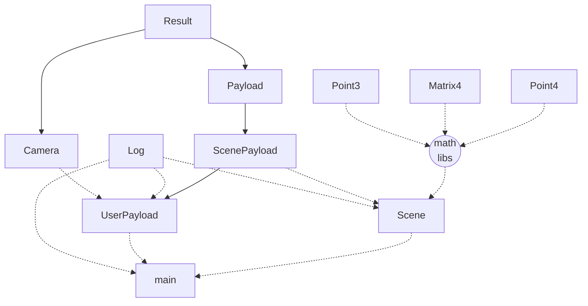

# Shabnigroth

0. [Core](#core)
1. [OpenGL](#opengl) libray (developing)
2. [Neuronet](neuronet) shabnigroth (planed)

# Run

./make

# Current objects scheme

```mermaid
flowchart

ScenePayload
Log
Camera

math((math<br>libs))

Result --> Camera
Result --> Payload

Payload --> ScenePayload
Camera -.-> UserPayload
Log -.-> UserPayload

ScenePayload -->  UserPayload 
Log -.-> Scene
ScenePayload-.-> Scene

Log -.-> main


UserPayload -.-> main
Scene -.-> main


Point3 -.-> math
Matrix4 -.-> math
Point4 -.-> math

math -.-> Scene
```

# Core

# OpenGL

# Shabnigroth
