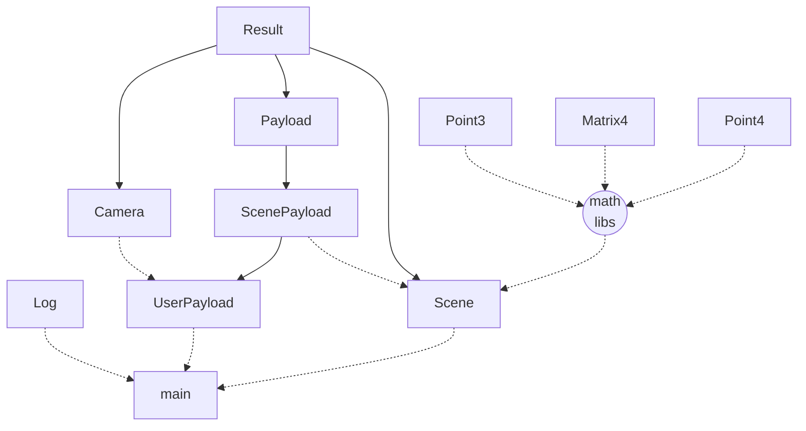

# Shabnigroth

1. [Core](#core)
0. [OpenGL](#opengl) libray (developing)
0. [Neuronet](#neuronet) shabnigroth (planed)


# Run

Install 

```
sudo apt install libglfw3 libglfw3-dev libglu1-mesa-dev
sudo apt install upx
```

Run:
```
./make
```


# Current objects scheme


```mermaid
flowchart


ScenePayload
Camera
Log

math((math<br>libs))


Payload --> ScenePayload
Camera -.-> UserPayload


ScenePayload -->  UserPayload
ScenePayload-.-> Scene

Result --> Camera
Result --> Payload
Result --> Scene


Log -.-> main

UserPayload -.-> main
Scene -.-> main

Point3 -.-> math
Matrix4 -.-> math
Point4 -.-> math

math -.-> Scene
```

1. Solid line - extends class
0. Dotted line - uses class

# Core

1. Core is contain the tiniy libraries for application with users controllers.


# OpenGL

1. User interface based on on [glfw](https://www.glfw.org/).
0. Supports:
    1. mouse events
    0. keyboards events
    0. math library for vectors operations
    0. matrix transformation


# Shabnigroth

1. Waiting.
