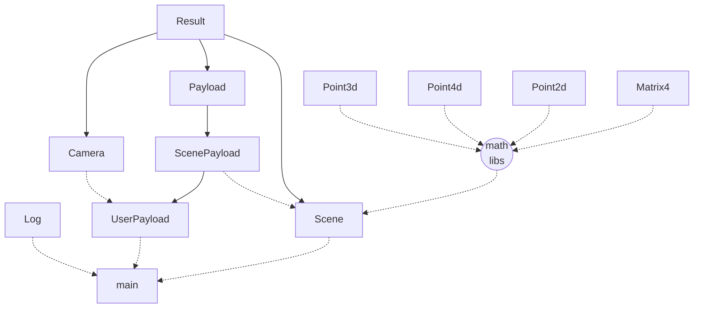

# Shabnigroth

This is Shabnigroth https://github.com/johnthesmith/shab neuronet with visual control.
The kernel was written in c++ and contains next components:

1. [Kernel](#kermel) - baisic c++ libraries
0. [OpenGL](#opengl) - graphics librayes
0. [Neuronet](#neuronet) - shabnigroth libraryes
0. [Shab](#shab) - small bash maker for Shabnigroth


# Run

Shab is building at Ubuntu 18.04 and more.

You need to install the following components:

```
sudo apt install libglfw3 libglfw3-dev libglu1-mesa-dev
sudo apt install upx
```

After that you need to run:
```
./make
```


# Kernel

1. Kernel is contain the tiniy libraries for application with users controllers.


# OpenGL

1. User interface based on on [glfw](https://www.glfw.org/).
0. Supports:
    1. mouse events
    0. keyboards events
    0. math library for vectors operations
    0. matrix transformation


## OpenGL objects scheme


```mermaid
flowchart

    ScenePayload
    Camera
    Log

    math((math<br>libs))


    Payload --> ScenePayload
    Camera -.-> UserPayload


    ScenePayload -->  UserPayload
    ScenePayload-.-> Scene

    Result --> Camera
    Result --> Payload
    Result --> Scene


    Log -.-> main

    UserPayload -.-> main
    Scene -.-> main

    Point3d -.-> math
    Point4d -.-> math
    Point2d -.-> math
    Matrix4 -.-> math

    math -.-> Scene
```

1. Solid line - extends class
0. Dotted line - uses class


# Shabnigroth

1. Waiting.
