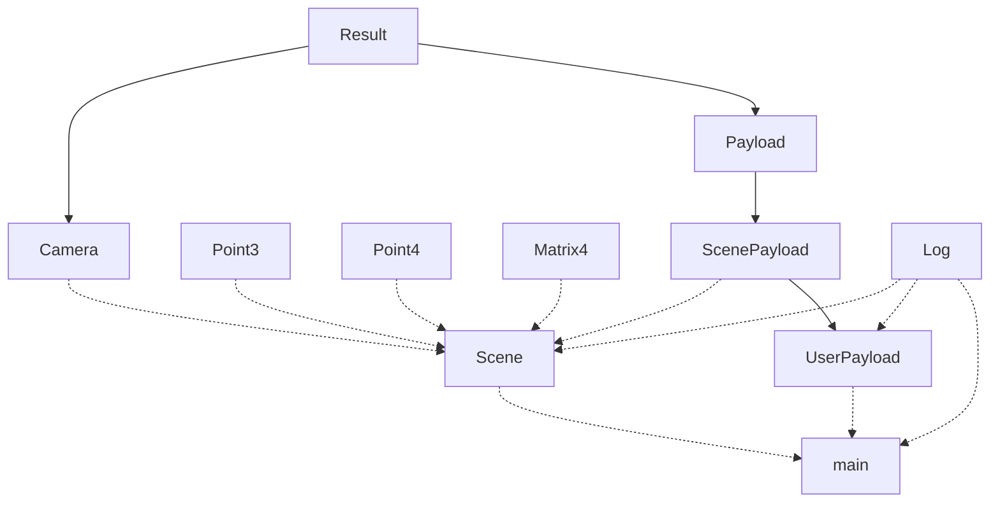

# Shabnigroth

0. [Core](#core)
1. [OpenGL](#opengl) libray (developing)
2. [Neuronet](neuronet) shabnigroth (planed)

```mermaid
flowchart

Result --> Camera
Result --> Payload

Point3 -.-> Scene
Point4 -.-> Scene
Matrix4 -.-> Scene

Payload --> ScenePayload
ScenePayload-.-> Scene
Camera -.-> Scene

Log -.-> Scene
Log -.-> UserPayload
Log -.-> main

ScenePayload -->  UserPayload 

UserPayload -.-> main
Scene -.-> main
```
# Run

./make

# Core

# OpenGL

# Shabnigroth
