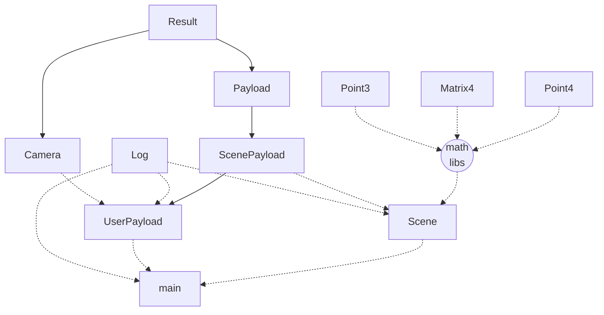

# Shabnigroth

1. [Core](#core)
0. [OpenGL](#opengl) libray (developing)
0. [Neuronet](#neuronet) shabnigroth (planed)

# Run

./make

# Current objects scheme

```mermaid
flowchart

ScenePayload
Log
Camera

math((math<br>libs))

Result --> Camera
Result --> Payload

Payload --> ScenePayload
Camera -.-> UserPayload
Log -.-> UserPayload

ScenePayload -->  UserPayload 
Log -.-> Scene
ScenePayload-.-> Scene

Log -.-> main


UserPayload -.-> main
Scene -.-> main


Point3 -.-> math
Matrix4 -.-> math
Point4 -.-> math

math -.-> Scene
```

# Core

1. Core is contain the tiniy libraries for application with users controllers.

# OpenGL

1. User interface based on on [glfw](https://www.glfw.org/).
0. Supports:
    1. mouse events
    0. keeboards events
    0. simple math library for 3 and 4 components vectors.
    0. simple 

# Shabnigroth

1. Waiting.
