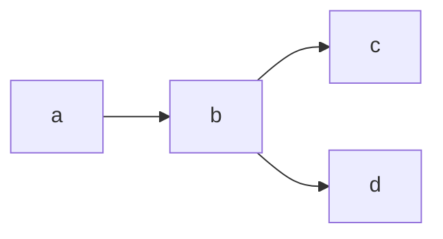

# Заголовок 1

"```" - текст выглядт как есть. с пробелами и равноширинным шрифтом. 

```
git add -A                      // Добавить измененные файлы в индекс на локальной машине.
git commit -m "Text message"    // Сделать коммит по проиндексированным файлам
git pull                        // Скачать измения сделанные с последнего обновления (клонирования)
git push                        // Залить изменения коммиты на гит
```

Для пуша можно использовать файл если он есть в проекте:

```
./push "тест для комита"
```


> :warning: Это предупрежденеи


## Это заголовок второго уровня

Это просто текст. Это просто текст.Это просто текст.Это просто текст.Это просто текст.Это просто текст.
Это просто текст.Это просто текст.Это просто текст.
Это просто текст.Это просто текст.

фывфыв в ыфв фы выф вфы вфы
фы выф ыф фы вфы вфы
ф ывыф выф


### Это заголовок третьего уровня

Это новая строка.


## Нумерованный список

1. узцш уцзшуцзщ ш
0. зущц азущц ашцузщашцузща
0. узцш уцзшуцзщ ш
0. узцш уцзшуцзщ ш
0. фвош оуцщшовцущ швцу
0. узцш уцзшуцзщ ш
0. узцш уцзшуцзщ ш


## Не нумерованный список

- узцш уцзшуцзщ ш
- зущц азущц ашцузщашцузща
- узцш уцзшуцзщ ш
- узцш уцзшуцзщ ш
- фвош оуцщшовцущ швцу
- узцш уцзшуцзщ ш
- узцш уцзшуцзщ ш


## Сложный список

1. узцш уцзшуцзщ ш
0. зущц азущц ашцузщашцузща
0. узцш уцзшуцзщ ш
    1. узцш уцзшуцзщ ш
    0. фвош оуцщшовцущ швцу
    0. узцш уцзшуцзщ ш
0. узцш уцзшуцзщ ш
0. фвош оуцщшовцущ швцу
0. узцш уцзшуцзщ ш
    - узцш уцзшуцзщ ш
    - фвош оуцщшовцущ швцу
    - узцш уцзшуцзщ ш
0. узцш уцзшуцзщ ш


## Таблица

|колонка1|колонка2|колонка3|
|:-:|-:|-|
|asfdsadasd     |sadsadas|asdsadas|
|asfdsadasd     |sadsadas|asdsadas|
|asfdsadasd     |ssdfsdfadsadas|asdsadas|
|asfdsasdfsddasd|sadsadas|asdsadas|
|asfdsadasd     |sadsadas|asdsadas|


## Ссылка

швцушщцгк цущк щшцу гкщшцу цущшк Сайт для рисования BPMN диаграмм [Mermaid](https://mermaid.live/edit). А вот это ссылка на [якорь](#это-заголовок-второго-уровня)
Ссылка на [нумерованный список](#нумерованный-список)



